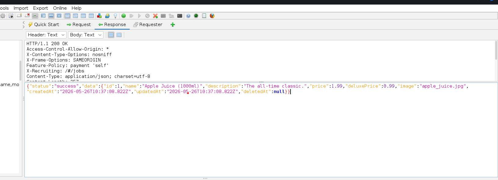
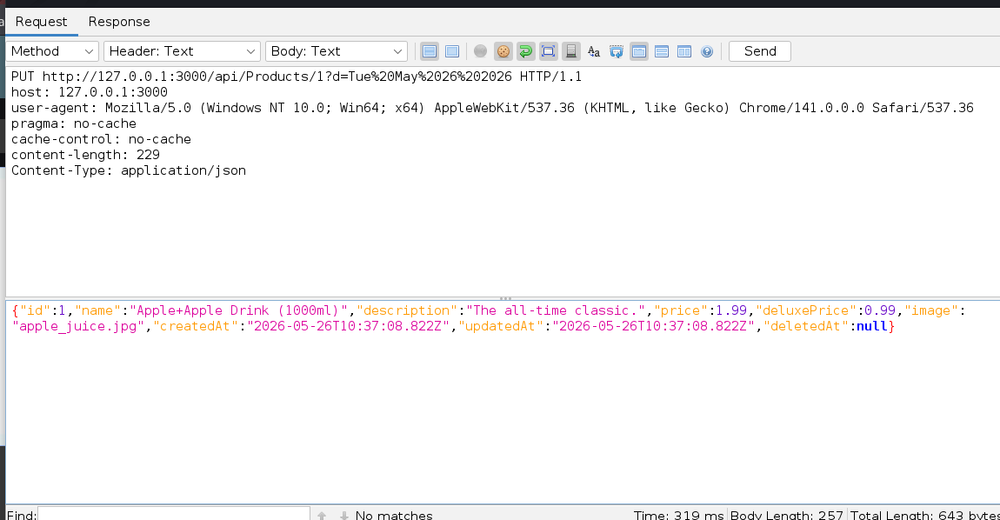
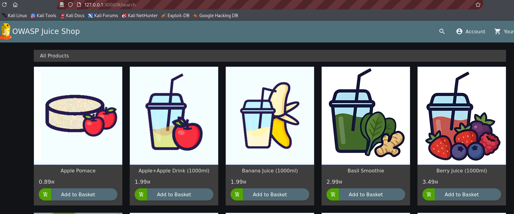

## Unauthorized Product Modification – API Misconfiguration Vulnerability Report

### Application Tested

OWASP Juice Shop (Local Lab Environment)

### Vulnerability Type

Broken Access Control / Unauthorized API Modification

---

## Description

During testing of the application API endpoints, I discovered that product information can be modified through direct API requests without proper authorization checks.

By intercepting and modifying requests in OWASP ZAP, I was able to change product details directly through the `/api/products` endpoint. This indicates that the API does not properly restrict unauthorized modification requests.

---

## Steps to Reproduce

### Step 1: Locate the Product API Endpoint

1. Open OWASP ZAP.
2. Navigate to the Site Tree or History tab.
3. Locate the API endpoint:

4. Open the response message associated with the endpoint.

---

### Step 2: Copy the Response Body

1. Observe that the original request contains little or no editable body content.
2. Copy the JSON response body returned from the API.

---

### Step 3: Prepare the Modified Request

1. Change the HTTP request method from: GET to PUT
2. Add the following header:Content-Type: application/json
3. Remove unnecessary response fields such as:

* `success`
* `id`

4. Modify the product name value.

Example:

Change:
Apple Juice
to:
Apple+Apple Drink

---

### Step 4: Send the Modified Request

1. Send the modified request to the server.
2. Observe the response and refresh the application page.

---

### Step 5: Verify Product Modification

1. Return to the application.
2. Refresh the product page.
3. Observe that the product name has been changed successfully.

---

## Result

The application accepts unauthorized API modification requests and allows product data to be altered successfully.

---

## Expected Result

Only authorized administrators or privileged users should be able to modify product information through the API.

---

## Actual Result

The API accepts modified requests and updates product data without proper authorization validation.

---

## Impact

This vulnerability may allow attackers to:

* Modify product information
* Tamper with prices or descriptions
* Deface application content
* Mislead customers
* Abuse backend functionality through unauthorized API access

In real-world applications, this could lead to financial loss, reputational damage, and compromise of system integrity.

---

## Conclusion

The `/api/products` endpoint is vulnerable to unauthorized modification due to insufficient access control and improper API authorization enforcement.

---

## Recommended Fix

* Enforce strict authorization checks on API endpoints
* Restrict modification actions to authorized administrators only
* Validate user roles before processing update requests
* Implement proper API authentication and permission controls
* Log and monitor unauthorized modification attempts
