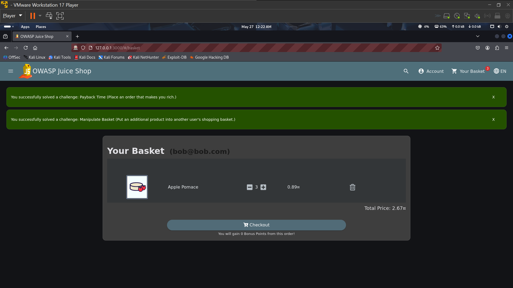
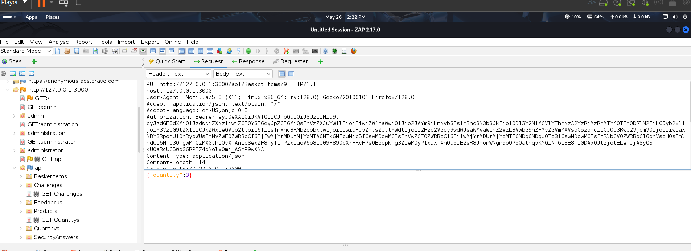
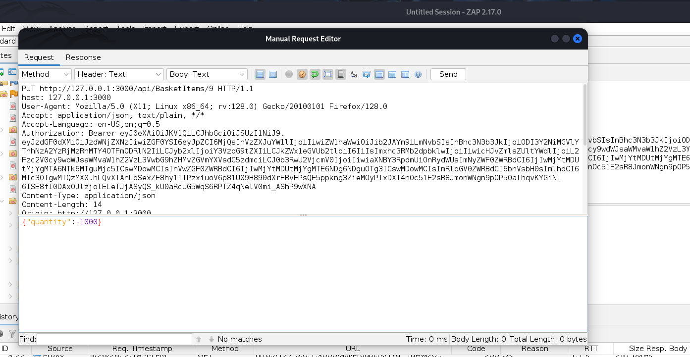
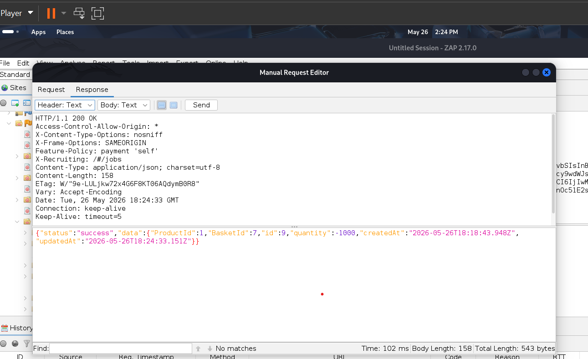
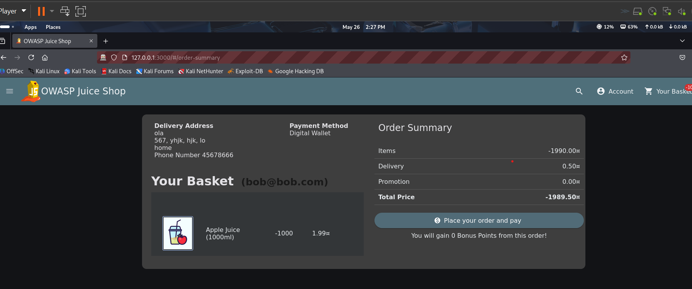
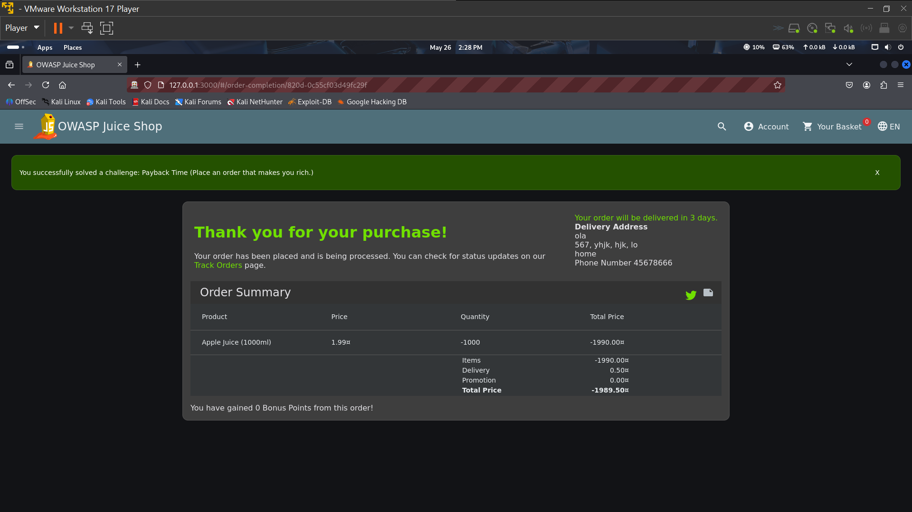

Quantity Manipulation / Negative Value Injection Vulnerability Report

Application Tested

OWASP Juice Shop (Local Lab Environment)

Vulnerability Type

Business Logic Vulnerability / Parameter Manipulation

⸻

Description

During testing of the shopping cart functionality, I discovered that the application improperly validates quantity values submitted by the user. By intercepting and modifying the quantity parameter in a request, negative values can be inserted and accepted by the server.

This vulnerability allows manipulation of product quantities and pricing logic during checkout.

⸻

Steps to Reproduce

Step 1: Add Product to Cart
 1. Open the application shop page.
 2. Select any product.
 3. Increase the quantity of the product in the cart.

⸻

Step 2: Intercept the Request
 1. Open OWASP ZAP or another proxy tool.
 2. Navigate to the History tab and locate the request responsible for updating the product quantity.
 3. Identify the PUT request containing the quantity (qty) parameter.

⸻

Step 3: Modify the Quantity Value
 1. Open the request in the Request Editor.
 2. Change the quantity value from a normal number to a negative value such as: -1000
 3. Send the modified request to the server.

⸻

Step 4: Observe the Server Response
 1. The server accepts the request successfully.
 2. A success response is returned even though the quantity is negative.

⸻

Step 5: Complete the Purchase
 1. Return to the browser.
 2. Refresh the cart or checkout page.
 3. Proceed with checkout and complete the purchase.

⸻

Result

The application accepts negative quantity values and processes them successfully. This allows manipulation of the checkout process and may lead to purchasing a large quantity of items for an incorrect or heavily reduced price.

⸻

Expected Result

The application should validate quantity values and reject:
 • Negative numbers
 • Invalid numeric values
 • Extremely large or manipulated inputs

The server should only allow valid positive integers for product quantities.

⸻

Actual Result

The server processes negative quantity values successfully and applies them during checkout.

⸻

Impact

This vulnerability may allow attackers to:
 • Manipulate product pricing
 • Purchase products at incorrect prices
 • Abuse discounts or cart calculations
 • Cause financial loss to the application owner
 • Disrupt inventory management systems

In real-world applications, this type of business logic flaw could lead to significant financial abuse.

⸻

Conclusion

The application does not properly validate quantity values before processing cart updates and checkout requests. Negative input values should never be accepted in quantity-related parameters.

⸻

Recommended Fix
 • Validate quantity values on the server side
 • Reject negative or invalid numeric inputs
 • Implement strict business logic validation
 • Use minimum and maximum quantity restrictions
 • Recalculate pricing securely on the backend before checkout
