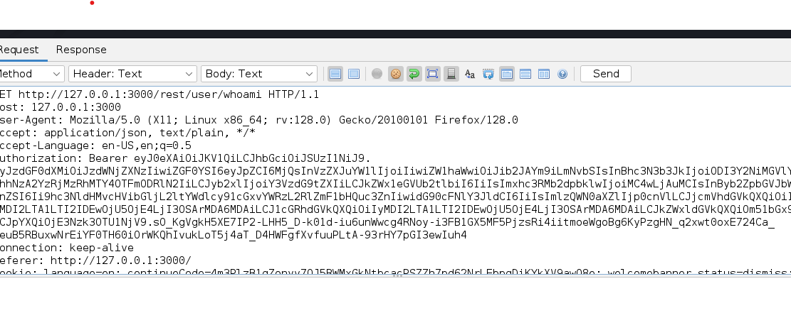
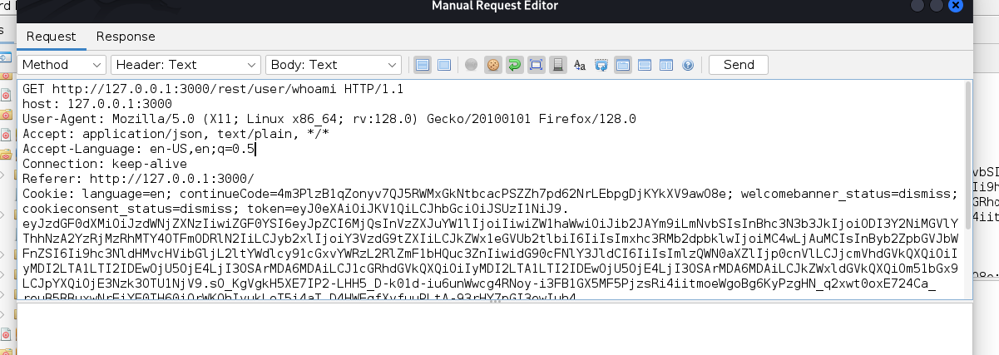
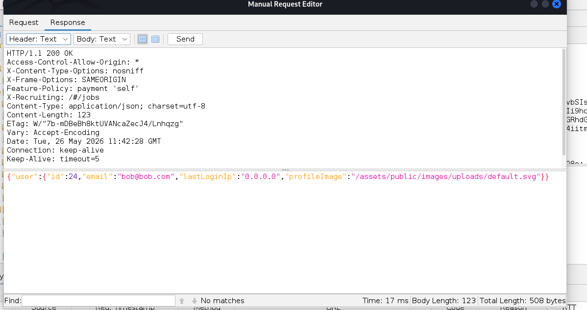

Authorization Header Manipulation – Broken Access Control Vulnerability Report

Application Tested

Vulnerability Type

Broken Access Control / Authorization Header Manipulation

⸻

Description

During testing of the application after login, I discovered a vulnerability related to how the system handles authorization. The application continues to allow access to protected resources even when the Authorization header is removed from the request.

This indicates that the server is not properly enforcing authentication or validating session tokens on every request.

⸻

Steps to Reproduce

Step 1: Login to the Application
 1. Open the application login page.
 2. Enter valid credentials.
 3. Click login and successfully access the dashboard.

Step 2: Intercept the Request
 1. I Open browser developer tools or a proxy tool (such as Burp Suite or similar).
 2. Capture a request made after login (for example, a user profile or API request).
 3. Locate the Authorization header in the request.

Step 3: Modify the Request
 1. Remove the Authorization header completely from the request.
 2. Forward the modified request to the server.

⸻

Step 4: Observe the Response
 1. The server still processes the request successfully.
 2. Access to the protected resource is still granted even without the Authorization header.

Result

The application continues to accept requests even after the Authorization header is removed. This confirms that the backend does not properly enforce authorization checks.

⸻

Expected Result

The server should reject requests that do not contain a valid Authorization header and return an authentication error (such as 401 Unauthorized or 403 Forbidden).

⸻

Actual Result

Requests without the Authorization header are still accepted and processed successfully.

⸻

Impact
 • Unauthorized access to protected endpoints
 • Potential exposure of sensitive user data
 • Bypass of authentication and session control mechanisms
 • Increased risk of full account compromise in real-world systems

⸻

Conclusion

The application is vulnerable to broken access control due to improper validation of the Authorization header. Sensitive endpoints should not be accessible without proper authentication enforcement on every request.

⸻

Recommended Fix
 • Enforce strict server-side validation of Authorization headers on every request
 • Implement token validation middleware
 • Return proper HTTP status codes (401/403) for unauthorized requests
 • Avoid relying on client-side security checks
 • Ensure session or JWT tokens are verified for each protected endpoint
