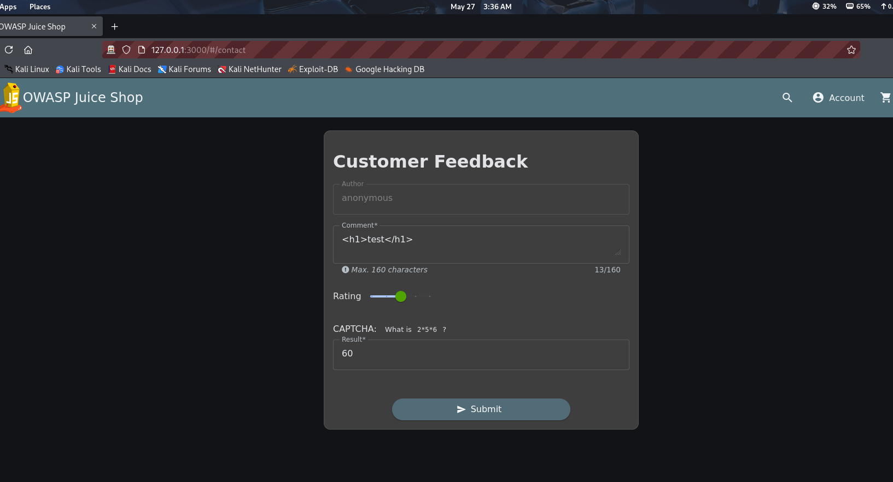
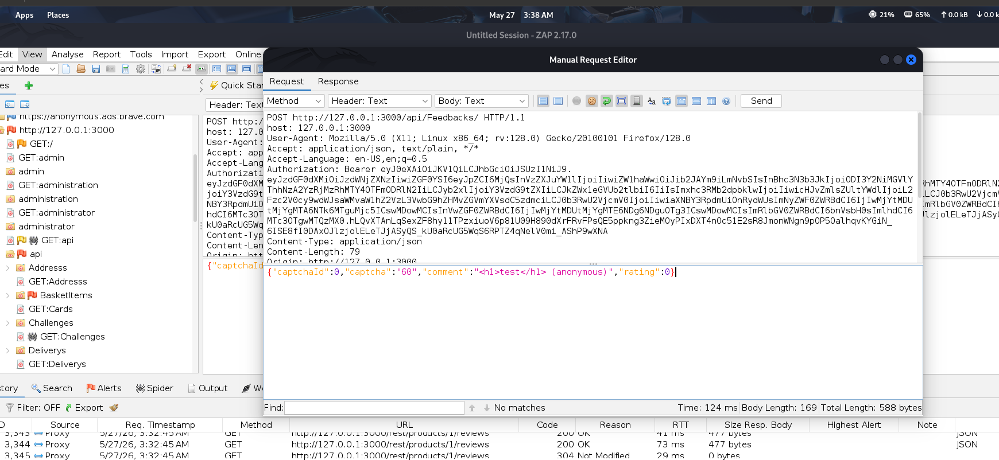
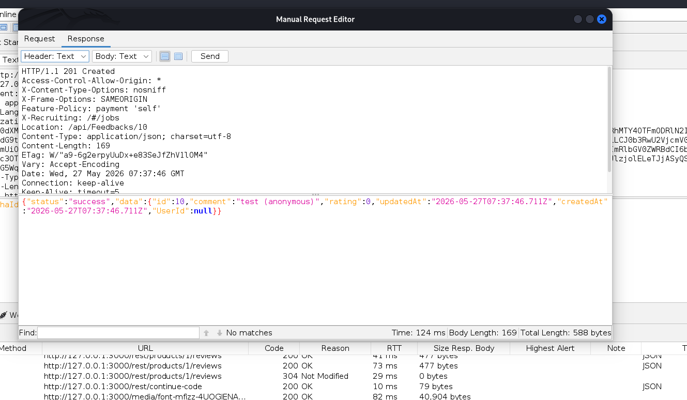
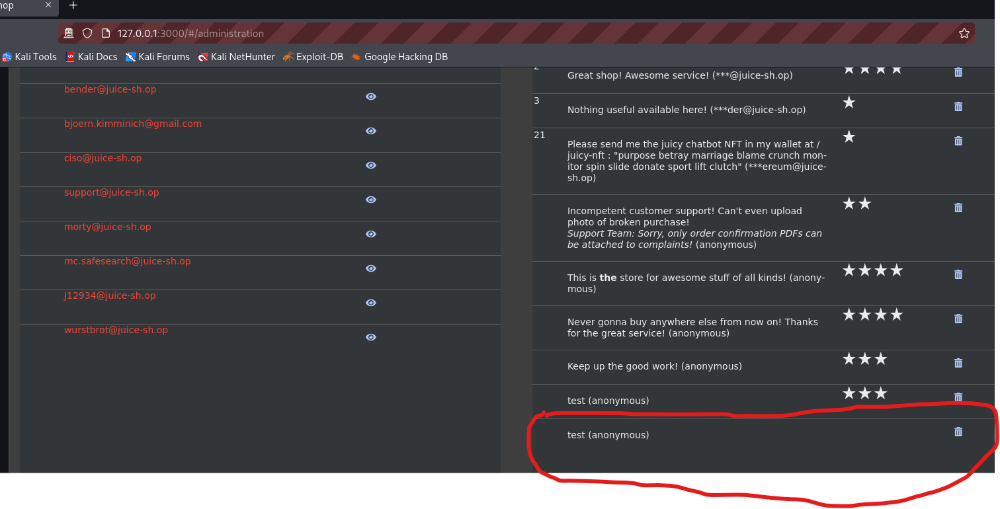

## Rating Manipulation / CAPTCHA Validation Bypass Vulnerability Report

### Application Tested

OWASP Juice Shop (Local Lab Environment)

### Vulnerability Type

Business Logic Vulnerability / Input Validation Failure

---

## Description

During testing of the customer feedback functionality, I discovered that the application improperly validates rating values submitted by users.

The application interface normally restricts ratings to valid values, and a CAPTCHA challenge is also presented before submission. However, by intercepting and modifying the request, it is possible to submit an invalid rating value of `0`, which should not normally be allowed.

This indicates that the server does not properly validate submitted rating values and relies mainly on client-side controls.

---

## Steps to Reproduce

### Step 1: Open Customer Feedback Page

1. Navigate to the customer feedback section of the application.
2. Enter a comment in the feedback form.
3. Select a valid rating value such as `3`.
4. Complete the CAPTCHA challenge.
5. Submit the feedback form.

---

### Step 2: Intercept the Request

1. Open OWASP ZAP or another proxy tool.
2. Go to the History tab.
3. Locate the request responsible for submitting the feedback.
4. Open the request in the Request Editor.
5. 

---

### Step 3: Modify the Rating Value

1. Locate the rating parameter in the request.
2. Change the rating value from:

3
to:
0

3. Send the modified request to the server.

---

### Step 4: Observe the Response

1. The server accepts the modified request successfully.
2. The zero-star rating is processed and stored by the application.

---

## Result

The application accepts an invalid rating value of `0` after request manipulation, even though the normal interface does not allow it.

---

## Expected Result

The server should validate all rating values and reject any values outside the allowed range. CAPTCHA validation should also properly protect the submission process against manipulated requests.

---

## Actual Result

The server processes the manipulated request successfully and accepts a zero-star rating.

---

## Impact

This vulnerability may allow attackers to:

* Submit invalid ratings or reviews
* Manipulate product reputation or feedback systems
* Bypass intended business rules
* Abuse application logic through crafted requests
* Undermine trust in customer review systems

The issue also demonstrates weak server-side validation and insufficient protection against modified requests.

---

## Conclusion

The application does not properly validate rating values on the server side. Client-side restrictions and CAPTCHA protection alone are insufficient because attackers can modify requests before they reach the server.

## Recommended Fix

* Validate rating values strictly on the server side
* Reject values outside the allowed rating range
* Ensure CAPTCHA verification is enforced server-side
* Avoid relying only on client-side controls
* Implement stronger request integrity validation mechanisms
