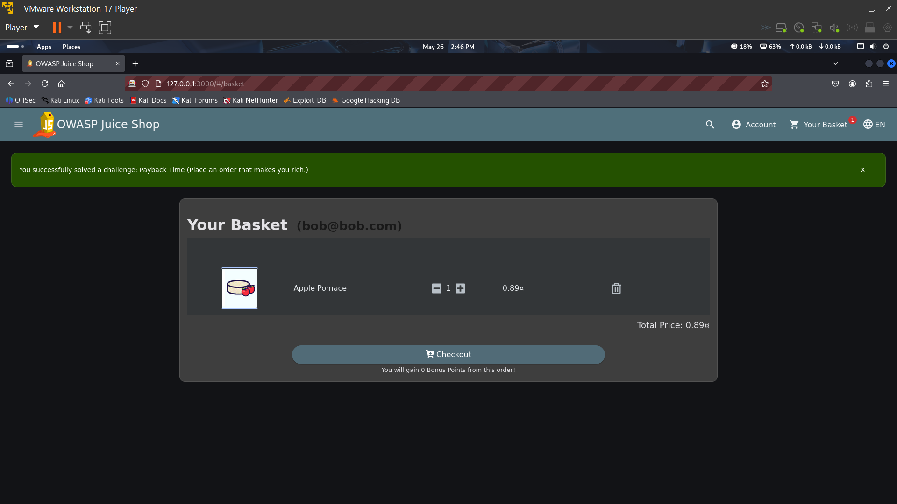
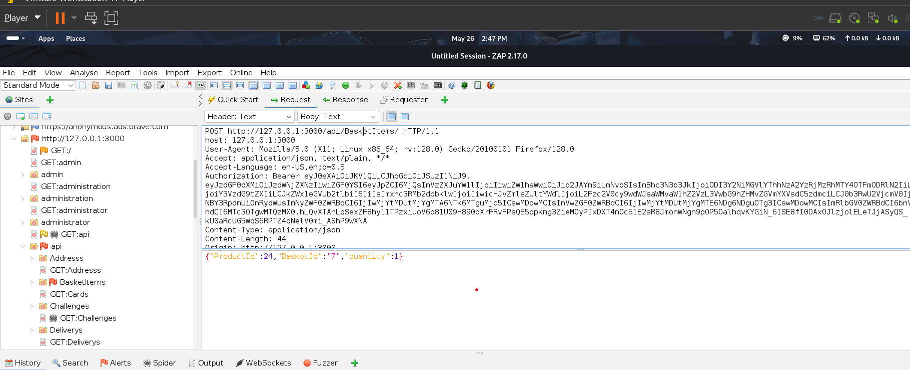
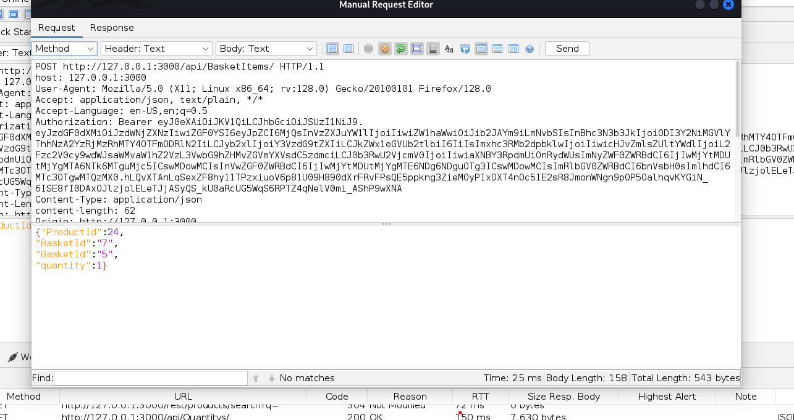
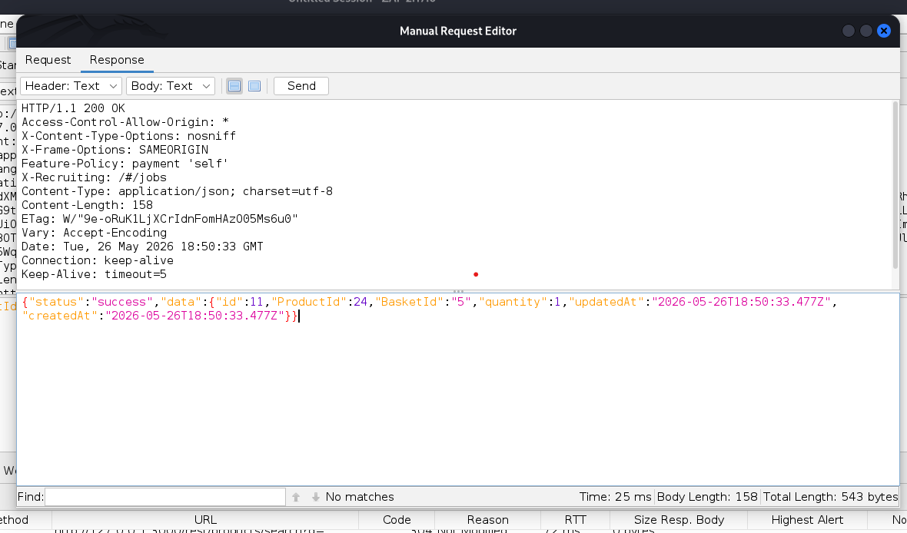

Insecure Direct Object Reference (IDOR) – Basket Access Vulnerability Report

Vulnerability Type

Insecure Direct Object Reference (IDOR) / Broken Access Control

⸻

Description

During testing of the shopping basket functionality, I discovered that basket identifiers can be manipulated to access another user’s basket information.

The application uses a basket ID parameter to identify user carts, but it does not properly verify whether the authenticated user is authorized to access the requested basket.

This allows an attacker to modify the basket ID value and potentially view or interact with another user’s shopping cart.

⸻

Steps to Reproduce

Step 1: Add Product to Basket
 1. Login to the application.
 2. Add any product to the shopping basket.

⸻

Step 2: Intercept the Request
 1. Open OWASP ZAP or another proxy tool.
 2. Go to the History tab.
 3. Locate the request related to the basket operation.
 4. Observe the basket ID parameter in the request.

⸻

Step 3: Modify the Basket ID
 1. Open the request in the Request Editor.
 2. Change the basket ID from: basketId: 7
To:

basketId: 5

3. Send the modified request to the server.
4. 

⸻

Step 4: Observe the Response
 1. The server responds successfully.
 2. Data belonging to another basket becomes accessible.

⸻

Result

The application accepts modified basket ID values and returns data for baskets belonging to other users.

⸻

Expected Result

The application should verify ownership of every basket request and deny access when a user attempts to access a basket that does not belong to them.

⸻

Actual Result

The server processes manipulated basket IDs successfully without validating authorization.

⸻

Impact

This vulnerability may allow attackers to:
 • Access other users’ shopping baskets
 • View sensitive shopping information
 • Modify or interfere with another user’s cart
 • Perform unauthorized actions on behalf of other users
 • Exploit customer data in real-world applications

This is a serious access control issue because users should never be able to access resources belonging to other accounts.

⸻

Conclusion

The application is vulnerable to Insecure Direct Object Reference (IDOR) due to improper authorization checks on basket resources. Basket ownership must be validated on the server side before granting access.

⸻

Recommended Fix
 • Implement strict server-side authorization checks
 • Verify basket ownership before processing requests
 • Avoid exposing predictable sequential IDs
 • Use indirect object references or UUIDs where possible
 • Log and monitor unauthorized access attempts
