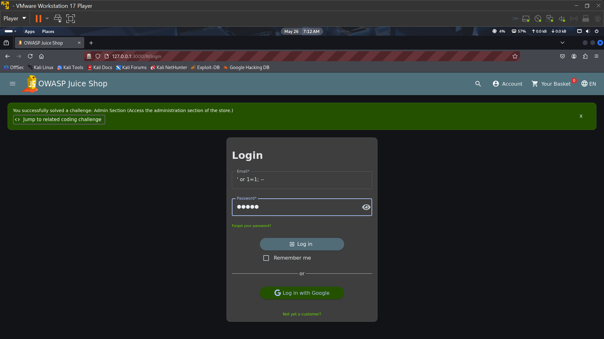
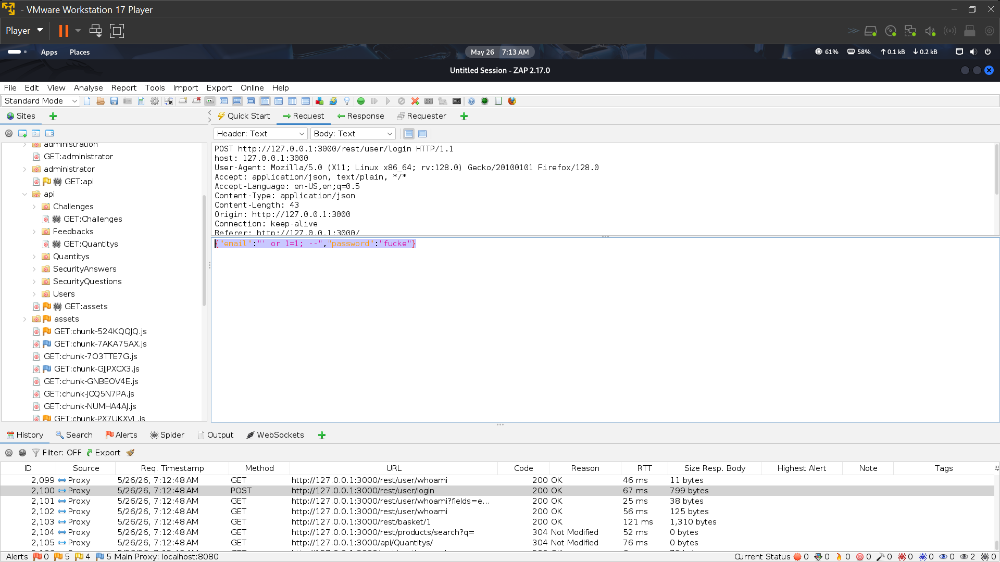
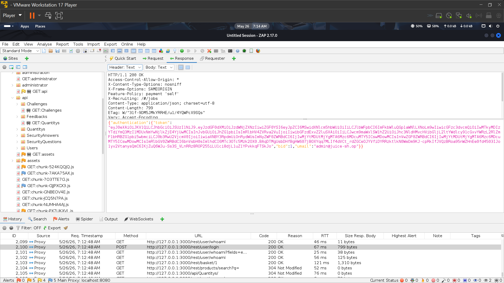
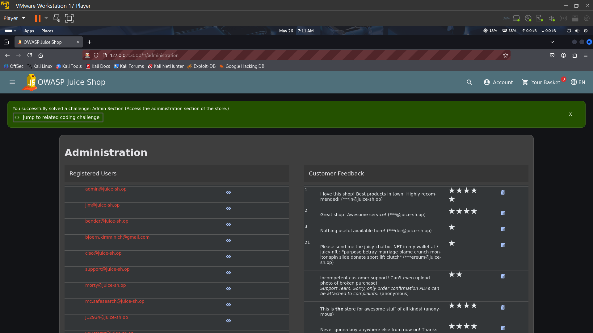

SQL Injection (SQLi) – Login Bypass Vulnerability Report

Application Tested

OWASP Juice Shop (Local Lab Environment)

Vulnerability Type

SQL Injection (Authentication Bypass)

⸻

Description

During testing of the login page, I discovered that the application is vulnerable to SQL Injection. This allows an attacker to bypass authentication and gain unauthorized access without knowing valid credentials.

The issue happens because user input on the login form is not properly validated or sanitized before being processed by the database.

⸻

Steps to Reproduce
 1. Open the login page of the application.
 2. In the email/username input field, enter the following payload: ' or 1=1--;
3. Enter any value (or leave the password field blank).
 4. Click the login button.

Result

After submitting the payload, the application logs the user in successfully without requiring valid credentials. This confirms that the authentication system can be bypassed using SQL Injection.

⸻

Expected Result

The application should reject invalid login attempts and only allow access with correct username and password combinations.

⸻

Actual Result

The system accepted the injected input and granted access, bypassing authentication.

⸻

Impact
 • Unauthorized access to user accounts
 • Potential access to admin dashboard (if privileges are escalated)
 • Exposure of sensitive data stored in the database
 • Full compromise of application security in severe cases

⸻

Evidence

Request Screenshot

⸻

Response Screenshot

⸻

Conclusion

The login page is vulnerable to SQL Injection, allowing authentication bypass. Proper input validation, parameterized queries, and prepared statements should be implemented to fix this issue.

⸻

Recommended Fix
 • Use parameterized queries (prepared statements)
 • Validate and sanitize all user inputs
 • Implement ORM frameworks where possible
 • Disable direct SQL query concatenation
 • Add login rate limiting and monitoring
