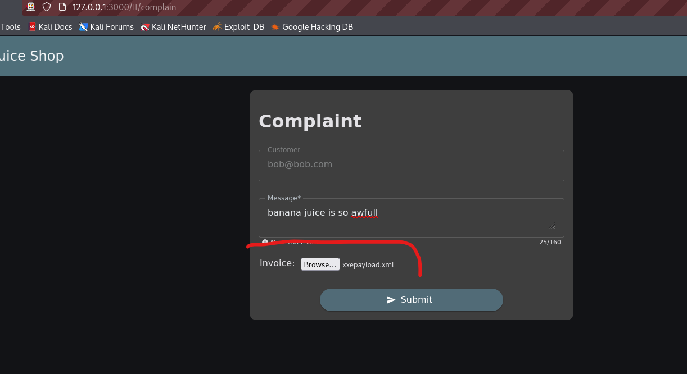
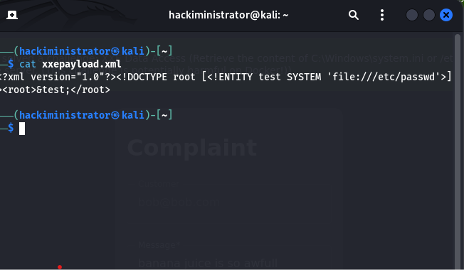
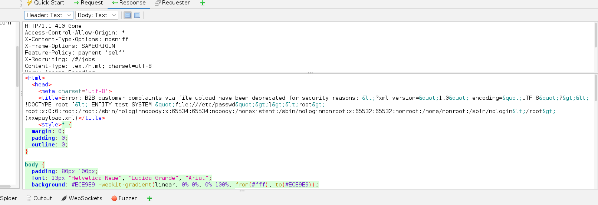

XML External Entity (XXE) Injection – File Disclosure Vulnerability Report
Application Tested

Vulnerability Type

XML External Entity (XXE) Injection

Description

During testing of the customer complaint functionality, I discovered that the application is vulnerable to XML External Entity (XXE) Injection through the file upload feature.

By uploading a crafted XML payload, the application processed external entities and returned sensitive server-side file contents in the response. This indicates that XML input is being parsed insecurely without disabling external entity processing.

Steps to Reproduce
Step 1: Open Customer Complaint Page
Navigate to the customer complaint section of the application.
Enter a complaint message in the text field.

Step 2: Upload Malicious XML Payload
Prepare an XML payload designed to request sensitive server-side file content.
Upload the XML file using the upload option on the complaint page.
Submit the complaint form.

Step 3: Observe Sensitive Data Disclosure
The server processes the XML payload successfully.
The response contains information requested by the XML payload, including contents from sensitive server files such as /etc/passwd.

Result

The application processes malicious XML external entities and exposes sensitive server-side file content in the response.

Expected Result

The application should reject malicious XML entities and prevent access to internal server files or resources.

Actual Result

The XML payload is processed successfully, and sensitive file information is returned in the response.

Impact

This vulnerability may allow attackers to:

Read sensitive server files
Access internal application data
Retrieve configuration files or credentials
Perform server-side request forgery (SSRF) in some environments
Escalate attacks against the application infrastructure

In real-world systems, XXE vulnerabilities can lead to serious server compromise and sensitive data exposure.

Conclusion

The application is vulnerable to XML External Entity (XXE) Injection because XML external entities are processed insecurely during file upload handling.

Recommended Fix
Disable external entity processing in XML parsers
Use secure XML parser configurations
Validate and sanitize uploaded files
Restrict accepted file formats where possible
Implement secure file upload validation and monitoring
