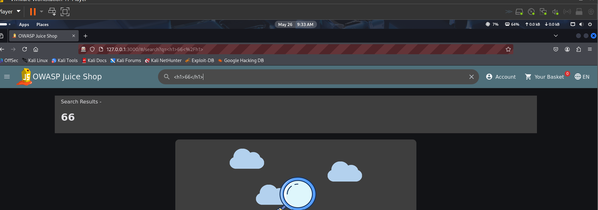
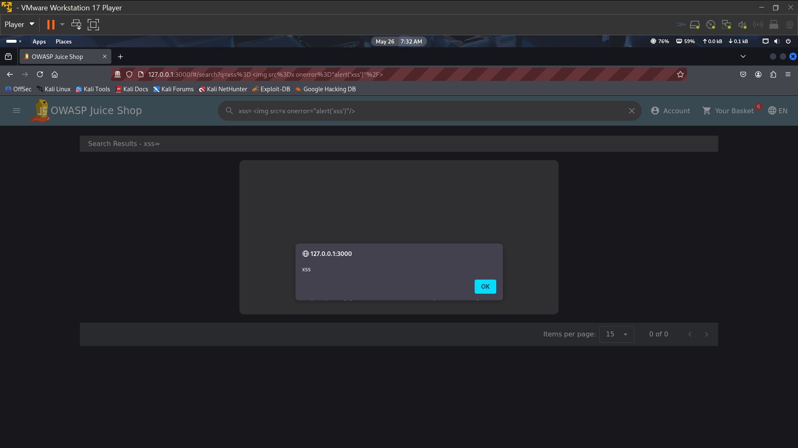
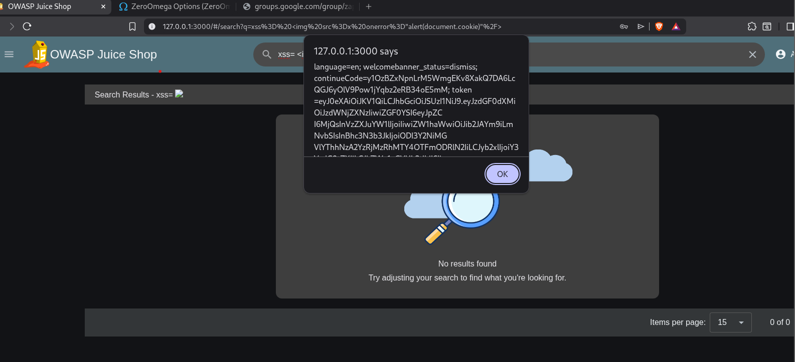

Cross-Site Scripting (XSS) – Stored/Reflected Input Injection Vulnerability Report

Application Tested

OWASP Juice Shop (Local Lab Environment)

Vulnerability Type

Cross-Site Scripting (XSS)

⸻

Description

During testing of the search functionality, I discovered that the application is vulnerable to Cross-Site Scripting (XSS). The input provided in the search bar is not properly sanitized or escaped before being rendered in the browser.

This allows an attacker to inject HTML and JavaScript payloads that execute in the victim’s browser.

⸻

Steps to Reproduce

Step 1: Test HTML Injection
 1. Open the application search bar.
 2. Enter the following input:

//<h1>66</h1>//

3. Submit the search.

⸻

Step 2: Test Basic XSS Payload
 1. In the search bar, enter: 
2. Submit the search.

⸻

Step 3: Test Sensitive Data Access (cookie Exposure)
 1. While inspecting the browser application, I observed that session-related information (such as token/cookies) can be accessed in the browser environment.
 2. I then tested the following payload :  
3. The script executed successfully and displayed data from the browser environment.

   

⸻

Result

The application successfully executes injected scripts through the search input field. This confirms the presence of a Cross-Site Scripting vulnerability.

⸻

Expected Result

The application should treat all user inputs as plain text and not execute or render them as HTML or JavaScript.

⸻

Actual Result

User input is rendered and executed as active HTML/JavaScript code in the browser.

⸻

Impact

This vulnerability is critical because it allows an attacker to:
 • Execute malicious scripts in a user’s browser
 • Perform session hijacking or steal authentication tokens (cookies/local storage)
 • Deface or modify page content
 • Perform actions on behalf of the user without consent
 • Potentially escalate attacks in a real production environment

In this case, attempts to access browser-stored data (such as token-related values) show that sensitive session information could be exposed depending on how the application stores authentication data.

⸻

Conclusion

The search input field is vulnerable to Cross-Site Scripting (XSS) due to improper input sanitization. This allows execution of malicious scripts in the browser, posing a significant security risk.

⸻

Recommended Fix
 • Sanitize and validate all user inputs
 • Encode output before rendering in the browser (HTML entity encoding)
 • Implement Content Security Policy (CSP)
 • Avoid directly inserting user input into the DOM using unsafe methods
 • Use frameworks that automatically escape HTML output
